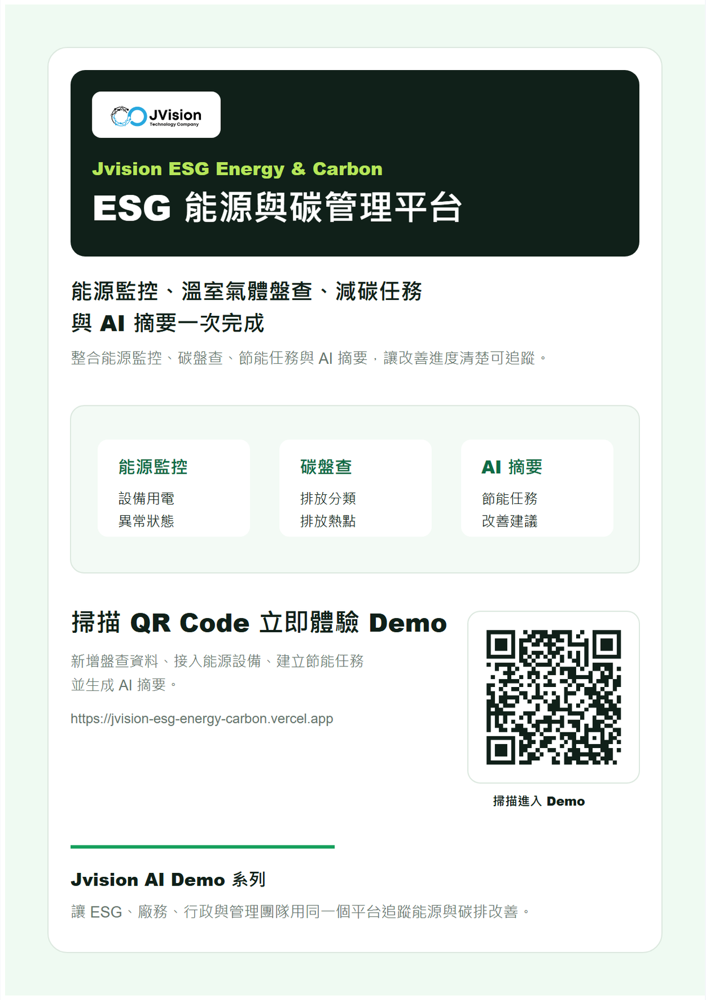

# Jvision ESG 能源與碳管理平台

整合「組織溫室氣體盤查平台」與「能源管理系統」的新獨立 Demo。原有展示仍保留，這個版本專注在 ESG、能源與碳排管理的一體化流程。



## Demo 功能

- 新增溫室氣體盤查活動數據
- 接入能源設備並切換設備狀態
- 依排放熱點建立節能任務
- 查看直接排放、外購能源排放與供應鏈排放來源排序
- 生成 Jvision AI 能源與碳排摘要

## 指令

```bash
npm install
npm run assets
npm run build
npm run verify
```

## 行銷素材

- `docs/marketing/jvision-esg-energy-carbon-poster.png`
- `docs/marketing/jvision-esg-energy-carbon-poster.pdf`
- `docs/marketing/jvision-esg-energy-carbon-product-introduction.pdf`
